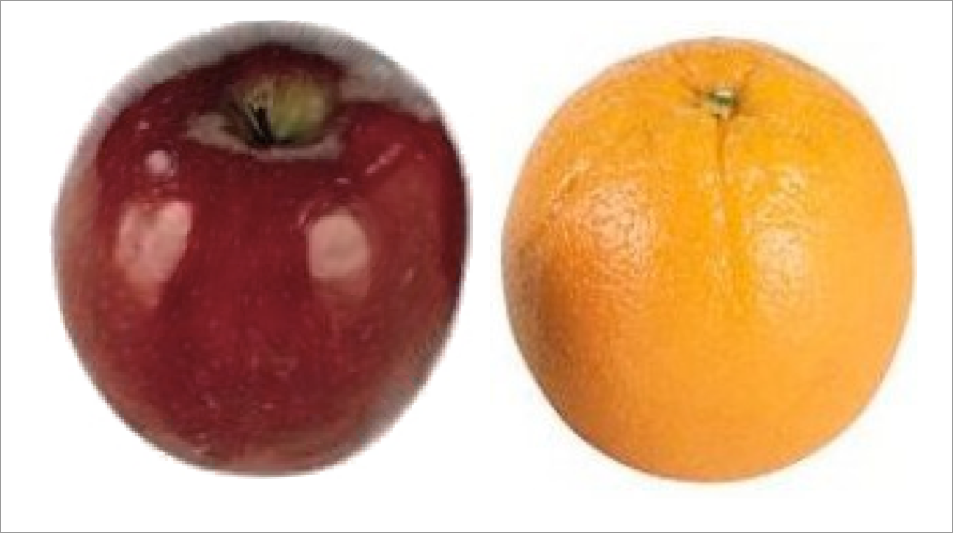
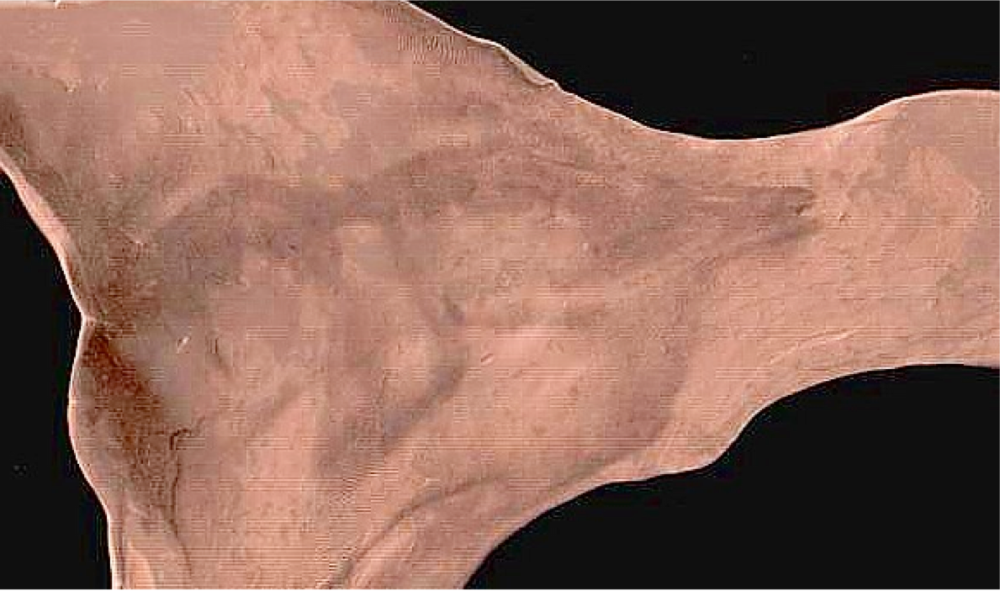
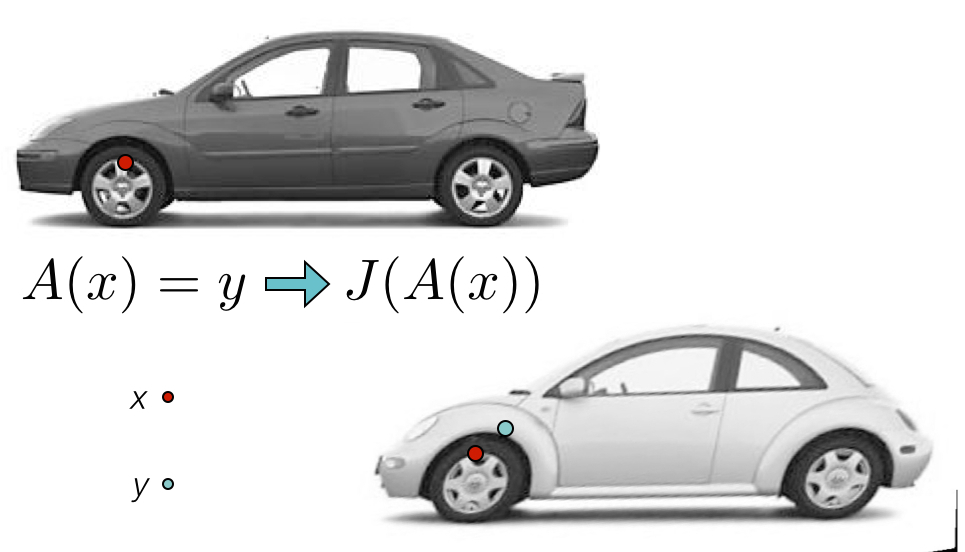
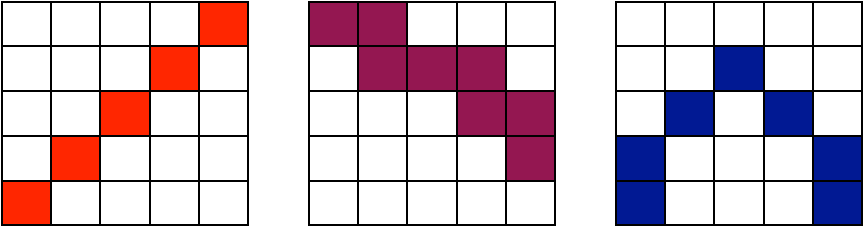
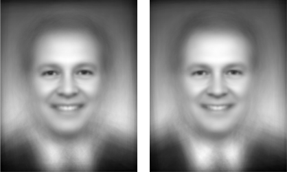
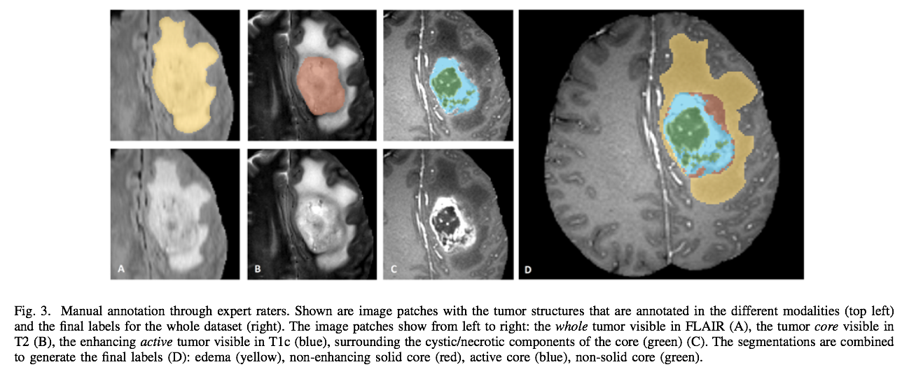

```{r global options, include=FALSE}
library(rmarkdown)
library(knitr)
figpath<-'FigsAntsRegistration/'
opts_chunk$set(fig.width=9, fig.height=6, fig.path=figpath,
               warning=FALSE, message=FALSE)
```

## 
<div align="center"></img></div>

This talk is online at [http://stnava.github.io/ANTsRegistrationTalk/](http://stnava.github.io/ANTsRegistrationTalk/) with colored [links](http://stnava.github.io/ANTsRegistrationTalk/) meant to be clicked for more information

## we *can* compare apples and oranges ... 


initialization

## we *can* compare apples and oranges ... 


<span style="color:red;">R</span><span style="color:green;">G</span><span style="color:blue;">B</span> affine

## we *can* compare apples and oranges ... 



<span style="color:red;">R</span><span style="color:green;">G</span><span style="color:blue;">B</span> deformable registration - i.e. registration on color

# *ANTs* optimizes mathematically <br /> well-defined  <br /><span style="color:red;">objective functions</span>  <br />guided by <br /> <span style="color:red;">prior knowledge</span>  ...

# plug *your ideas* <br />into our software: <br /> <span style="color:blue;"> <span style="color:red;">innovation, insight</span> <br />from biomedical data</span> ...


## ANTs Lineage 


## Diffeomorphisms

<div align="center"></img></div>

plausible physical modeling of large, invertible deformations

"differentiable map with differentiable inverse"

## Fine-grained and flexible maps


## ANTs: Beyond Registration


[Atropos](http://www.ncbi.nlm.nih.gov/pubmed/?term=atropos+tustison) segmentation, [N4 inhomogeneity correction](http://www.ncbi.nlm.nih.gov/pubmed/?term=N4+tustison), [Eigenanatomy](http://www.ncbi.nlm.nih.gov/pubmed/?term=eigenanatomy+avants), [SCCAN](http://www.ncbi.nlm.nih.gov/pubmed/?term=sparse+canonical+avants), [Prior-constrained PCA](http://www.ncbi.nlm.nih.gov/pubmed/24852460), and [atlas-based label fusion](http://www.ncbi.nlm.nih.gov/pmc/articles/PMC4009425/) and [MALF](http://www.ncbi.nlm.nih.gov/pubmed/21237273) (powerful expert systems for segmentation)

but *this talk* focuses on the core registration functionality that is critical to the applications above


## Founding developers

<div align="center"></img></div>


## Long-term collaborators


$+$ [neurodebian](http://neuro.debian.net/pkgs/ants.html), [slicer](http://www.slicer.org/), [brainsfit](https://github.com/BRAINSia/BRAINSTools), [nipype](http://nipy.sourceforge.net/nipype/), [itk](http://www.itk.org) and more ...

## General purpose library for multivariate image registration, segmentation & statistical analysis tools

* 170,000+ lines of C++, 6$+$ years of work, 15+ collaborators. 

* Generic mathematical methods that are tunable for 
application specific domains:  no-free lunch

* Deep testing on multiple platforms ... osx, linux, windows.

* Several "wins" in public knock-abouts ( [Klein 2009](http://www.ncbi.nlm.nih.gov/pubmed/19195496), [Murphy 2011](http://www.ncbi.nlm.nih.gov/pubmed/21632295), [SATA 2012 and 2013](http://www.ncbi.nlm.nih.gov/pmc/articles/PMC3837555/), [BRATS 2013](http://martinos.org/qtim/miccai2013/proc_brats_2013.pdf), others ) 

```
    An algorithm must use prior knowledge about a problem 
    to do well on that problem 
```

# <span style="color:red;">Medical Image Registration</span> <br /> Fundamental tool for<br /> morphometry, segmentation,<br /> motion estimation and <br /> <span style="color:blue;">data cleaning</span>

## Definitions

* Registration $=$ estimate an "optimal" geometric mapping between image pairs or image sets (e.g. Affine)

* Similarity $=$ a function relating one image to another, given a transformation (e.g. mutual information)

* <span style="color:grey;">
Diffeomorphisms $=$ differentiable map with differentiable inverse (e.g. "silly putty", viscous fluid)  </span>

* Segmentation $=$ labeling tissue or anatomy in images, usually automated (e.g. K-means)

* <span style="color:grey;"> Multivariate $=$ using many voxels or measurements at once (e.g. PCA, $p >> n$ ridge regression)</span>

* Multiple modality $=$ using many modalities at once (e.g. DTI and T1 and BOLD)


## The Technical Framework


## ANTs Nomenclature / Standards 


## ANTs Nomenclature / Standards 


## ANTs Nomenclature / Standards 


## ANTs Nomenclature / Standards 


## The *A*-team of similarity metrics



$$ \| I - J \| ~~~~~~~~~~~~~~~~~~~ \frac{< I, J >}{\|I\|\|J\|} ~~~~~~~~~~~~~~~ p(I,J) log \frac{p(I,J)}{p(I)p(J)}$$

**all metrics** may be computed from **sparse** or **dense** samples and used with low or high-dimensional transformations

 
## The optimization problem

Find mapping $$ \color{red}{ \phi(x,p) \in \mathcal{T} }$$ such that

$$ \color{red}{ M(I,J,\phi(x,p)) } $$ is minimized

Must select both metric $\color{red}{M}$ and transformation $\color{red}{\mathcal{T}}$

... in addition to optimizer and the problem's resolution

## [SyN](http://www.ncbi.nlm.nih.gov/pmc/articles/PMC2276735/) for optimization symmetry

Images deform symmetrically along the shape manifold.  This eliminates bias in the
measurement of image differences.

##  [SyN (link)](http://www.ncbi.nlm.nih.gov/pmc/articles/PMC2276735/) Example

<!-- syn example -->

<div align="center"><iframe width="560" height="315" src="http://www.youtube.com/embed/3I9RcRtpOvw" frameborder="0" allowfullscreen></iframe></div>

[SyN movie](http://www.youtube.com/embed/3I9RcRtpOvw)


## Concatenated transformation / metric stages are necessary in real data

1.  Start with a *rigid transformation*:  $I \approx J(R(x))$ s.t. negative $MI(I,J,R)$ is minimized

2.  Follow by an *affine transformation*:  $I \approx J(A(R(x)))$ s.t. negative $MI(I,J,A \circ R)$ is minimized with fixed $R$

3.  Finally, a *diffeomorphism*:  $I \approx J(\phi(A(R(x))))$ s.t. $k$-neighborhood correlation $CC_k(I,J,A \circ R)$ is minimized with fixed $R, A$

4.  Output the *composite transform* $A \circ R$ as a matrix transformation and $\phi$ and $\phi^{-1}$ as deformation fields.

standard in [recommended](http://stnava.github.io/ANTsDoc/) `antsRegistration` application scripts 

## Minimizing interpolations


$\mathcal{T}_{total} = \mathcal{T}_1 \circ \mathcal{T}_2 \circ \mathcal{T}_3 \circ \mathcal{T}_4$

To avoid compounding interpolation error with the concatenation of transformations, *ANTs* never
uses more than a single interpolation.

We ported many of these ideas into the [Insight ToolKit](http://www.itk.org) as part of its V4 reboot!

## Registration benefits from<br /> *optimal sampling strategy*

* sampling for *both* the metric and the transformation

* impacts scalability, memory, optimization accuracy, speed, robustness ...

* could be done optimally *with massive improvements in performance*
    * but needs investment in order to achieve "dream" registration scenario

* important for new schemes that *elect* solutions from **anatomical or transformation** dictionaries

* overall, relatively little translational work on this important problem in biomedical imaging

## Sampling & feature selection: Satellite imagery

## Sampling & feature selection: Lesioned brains

# Evaluation results

## 


## Exploiting anatomical dictionaries with [label fusion (link)](http://www.ncbi.nlm.nih.gov/pmc/articles/PMC3049832/)


##


we provided the *standard* registration results for $>$ 20,000 image pairs at [SATA 2013](https://masi.vuse.vanderbilt.edu/workshop2013/index.php/MICCAI_2013_SATA_Challenge_and_Workshop:Current_events)

## Multiple metrics improve performance


# Differentiable maps with<br /> differentiable inverse <br />$+$ *statistics in these spaces*

## Brain templates as *high-dimensional averages*


## SyGN - templates and averages in deformation space


from [miykael](http://miykael.github.io/nipype-beginner-s-guide/ANTS.html)

[geodesic image averages](http://www.ncbi.nlm.nih.gov/pubmed/15501083)

[optimal templates 2](http://www.ncbi.nlm.nih.gov/pubmed/19818860)

[canine template](http://www.ncbi.nlm.nih.gov/pubmed/23284904)

[chimpanzees](http://www.ncbi.nlm.nih.gov/pubmed/23516289)


## Average Republican and Democratic congressmen

<div align="center"></img></div>

[congress](http://ntustison.github.io/CongressionalFaceTemplates/)

# ANTs versus Freesurfer 

# Registration & statistics:<br /> Frontiers and innovation

## multivariate statistical fields arise from fused modalities


*Many opportunities for statistical advancements*

## ITK+ANTs+R = <span style="color:red;">*ANTsR*</span>

## Agnostic statistics


[McMillan et al.](http://www.ncbi.nlm.nih.gov/pmc/articles/PMC3961542/)

## A Quick <span style="color:grey;">*ANTsR*</span> example
```{r loadantsr,results='hide',echo=FALSE,message=FALSE}
library(ANTsR)
```

This is an executable *ANTsR* code block - *N*-dimensional statistics to go with 
our *N*-dimensional image processing software!
```{r loadimages,message=FALSE,warning=FALSE,results='hide'}
library(ANTsR)
dim<-2
filename<-getANTsRData('r16')
img<-antsImageRead( filename , dim )
filename<-getANTsRData('r64')
img2<-antsImageRead( filename , dim )
mask<-getMask(img,150,255,T)
nvox<-sum( mask == 1 )
```
The brain has `r nvox` voxels ...

## A Quick <span style="color:grey;">*ANTsR*</span> example

Simulate a population morphometry study - a "VBM" ...
```{r morph,results='hide'}
simnum<-10
imglist<-list()
imglist2<-list()
for ( i in 1:simnum ) {
  img1sim<-antsImageClone(img)
  img1sim[ mask==1 ]<-rnorm(nvox,mean=0.205)
  SmoothImage(dim,img1sim,1.5,img1sim)
  img2sim<-antsImageClone(img2)
  img2sim[ mask==1 ]<-rnorm(nvox,mean=0.20)
  SmoothImage(dim,img2sim,1.5,img2sim)
  imglist<-lappend(imglist,img1sim)
  imglist2<-lappend(imglist2,img2sim)
}
imglist<-lappend( imglist, imglist2 )
mat<-imageListToMatrix( imglist, mask )
DX<-factor( c( rep(0,simnum), rep(1,simnum) ) )
mylmresults<-bigLMStats( lm( mat ~ DX ) )
qvals<-p.adjust( mylmresults$pval.model ) 
```
The minimum q-value is `r min(qvals)` ... 

## Visualize the histograms of effects
```{r vizmorph,results='hide'}
whichvox<-qvals < 1.e-8
voxdf<-data.frame( volume=c( as.numeric( mat[,whichvox] ) ), DX=DX )
ggplot(voxdf, aes(volume, fill = DX)) + geom_density(alpha = 0.2)
```

## Visualize the anatomical distribution
```{r vizmorph2hide,results='hide',echo=FALSE}
betas<-antsImageClone(mask)
betavec<-abs(mylmresults$beta.t[1,])
betas[mask==1]<-betavec
thresh<-paste(mean(betavec),'x',max(betavec),sep='')
ofn<-paste(figpath,'vizmorph2.jpg',sep='')
```

```{r vizmorph2,results='hide'}
plotANTsImage(img,functional=list(betas),threshold=thresh,
  outname=ofn)
```


## The power of *ANTs* $+$ *R* $\rightarrow$<br /> <span style="color:red;">**Reproducible imaging science**</span> 


... used in ["Sparse canonical correlation analysis relates network-level atrophy to multivariate cognitive measures in a neurodegenerative population"](http://www.ncbi.nlm.nih.gov/pubmed/24096125) and several upcoming ...

## Can we customize these methods for a challenging multivariate segmentation problem with clinical relevance?

## Automated tumor segmentation from multiple MRI


## General theory tunable to specific domains:  *no-free lunch*


[BRATS 2013 Challenge](http://hal.inria.fr/docs/00/93/56/40/PDF/brats_preprint.pdf) **won** with [*ANTsR*](https://github.com/stnava/ANTsR)

## Can we address subtle questions in brain and cognition via imaging-specific dimensionality reduction?

##  [Eigenanatomy](http://www.ncbi.nlm.nih.gov/pubmed/24852460) & [SCCAN](http://www.ncbi.nlm.nih.gov/pubmed/?term=avants+SCCAN)

## ANTs*R* $\rightarrow$ new insight via quantification

Good software should fade into the background ... however ...

<span style="color:red;">
 As is common in science, the first big breakthrough in our understanding ...
 [came from] an improvement in measurement.
</span>

<span style="color:blue;">
> Daniel Kahnemann, *Thinking, Fast and Slow* (2011)
</span>


# Analysis philosophy and <br /> published opinions

## What is and *is not*<br /> image registration

[*not* registration](http://www.ncbi.nlm.nih.gov/pubmed/23116330)

## Voodoo in voxel-based analysis

[logical circularity VBA](http://www.ncbi.nlm.nih.gov/pubmed/?term=logical+circularity+tustison)

## Instrumentation bias in the use and evaluation of software

[Instrumentation bias in the use and evaluation of software](http://www.ncbi.nlm.nih.gov/pmc/articles/PMC3766821/?report=reader)

# Conclusion

## Recap

- Powerful, general-purpose, <span style="color:red;">well-evaluated</span> registration and segmentation.

- Differentiable maps with differentiable inverse <span style="color:red;">$+$ statistics in these spaces</span>

- Evaluated in multiple problem domains</span> via internal studies & open competition

- Borg philosophy: <span style="color:red;">"best of"</span> from I/O, to processing to statistical methods

- Open source, testing, many examples, consistent style, multiple platforms,  active community support ...

- Integration with *R* $+$ novel tools for prediction, decoding, high-to-low dimensional statistics.

- Collaborations with [neurodebian](http://neuro.debian.net/pkgs/ants.html), [slicer](http://www.slicer.org/), [brainsfit](https://github.com/BRAINSia/BRAINSTools), [nipype](http://nipy.sourceforge.net/nipype/), [itk](http://www.itk.org) and more ...


## Challenges: Computational and Scientific

- Scalability: **need to fuse feature selection methods with transformation optimization**
- Scalability: **need to leverage existing ITK streaming infrastructure in application level tool**
- Domain expertise: Customizable for specific problems but sometimes not specific enough
- Rapid development: colleagues still need familiarity with compilation for latest ANTs features
- Latest theoretical advances in registration not yet wrapped for users
- Need more [Documentation](http://stnava.github.io/ANTs/)  & [testing](http://testing.psychiatry.uiowa.edu/CDash/index.php?project=ANTS) ...

## Tools you can use for imaging science

- Core developers:  *B. Avants, N. Tustison, H. J. Johnson, J. T. Duda*

- Many contributors, including users ...

- Multi-platform, multi-threaded C++ [stnava.github.io/ANTs](stnava.github.io/ANTs)

- Developed in conjunction with [http://www.itk.org/](http://www.itk.org/)

- R wrapping and extension [stnava.github.io/ANTsR](stnava.github.io/ANTsR)

- rapid development, regular testing $+$ many eyes $\rightarrow$ bugs are shallow


## References {#reffont}

